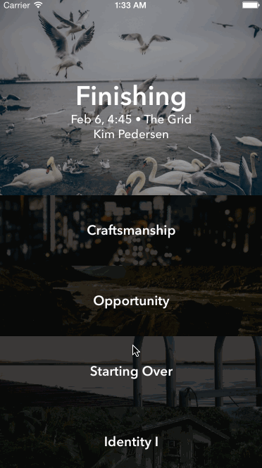
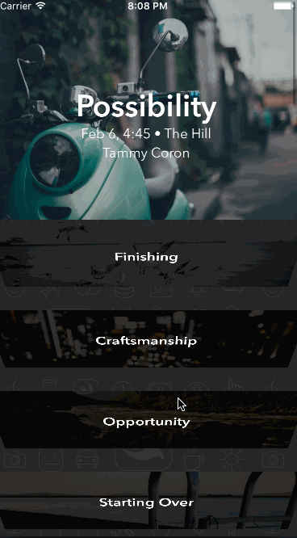
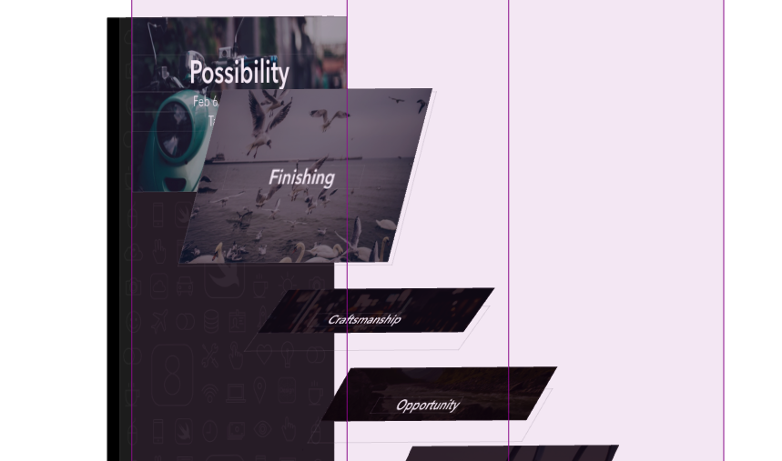

# Ultravisual
[raywenderlich教程](https://www.raywenderlich.com/99087/swift-expanding-cells-ios-collection-views)


##懵逼
虽然做了一些关于collectionViewLayout的demo了，感觉上也有了些自信，但是看到上面的gif的时候，然后按照自己的想法大致做了一下，GG。想法还是有所欠缺。
##原理
新建一个UltravisualLayout继承于UICollectionViewLayout

初始化一些变量

| variable | value | expression |
| --------- | --------- | --------- |
| dragOffset | 200 | cell变幻一次需要滚动的偏移量 |
| cache | [UICollectionViewLayoutAttributes] | 计算过的attributes缓存 |
| featuredItemIndex | max(0, Int(collectionView!.contentOffset.y / dragOffset)) | 当前变化的cell |

```
/* Return the size of all the content in the collection view */
    override func collectionViewContentSize() -> CGSize {
        // 需要滚动numberOfItems - 1 个偏移量才可以把最后一个item移动到最上面
        let contentHeight = (CGFloat(numberOfItems - 1) * dragOffset) + height
        return CGSize(width: width, height: contentHeight)
    }
```

###prepareLayout()
众所周知，又要开始重写这个方法了。

```
override func prepareLayout() {
        super.prepareLayout()
    	// 1.
        cache.removeAll(keepCapacity: false)

        let standardHeight = UltravisualLayoutConstants.Cell.standardHeight
        let featuredHeight = UltravisualLayoutConstants.Cell.featuredHeight
        
        var originY: CGFloat = 0
    
        for item in 0..<numberOfItems {
        	// 2.
            var height = standardHeight
        
            let indexPath     = NSIndexPath(forItem: item, inSection: 0)
            let attributes    = UICollectionViewLayoutAttributes(forCellWithIndexPath: indexPath)
            attributes.zIndex = item
            
            if item == featuredItemIndex {
                // 3.
                height = featuredHeight
                // 当 featuredItemIndex = featuredItemIndex + 1 时 临界点 (contentOffset.y变化)，下一张item的y位置应该是contentOffset.y，所以这里慢慢做滑动将图片上移
                originY = collectionView!.contentOffset.y - standardHeight * nextItemPercentageOffset
            }
            else if item == featuredItemIndex + 1 {
	            // 4.
                let heightOffset = max(0, (featuredHeight - standardHeight) * nextItemPercentageOffset)
                height = standardHeight + heightOffset
                // 当 featureItemIndex = item 时 临界点 ，此item.y位置应该是contentOffset.y，但是item.y ＝ 上一个(originY + height = contentOffset.y - standardHeight * nextItemPercentageOffset + featuredItemIndex * nextItemPercentageOffset(这个percent可以添加上，因为已经马上就是1了)  )
                originY -= heightOffset
            }
        	// 5.
            attributes.frame = CGRect(x: 0, y: originY, width: width, height: height)
            cache.append(attributes)
        
            originY += height
        }
    }
```

1. 移除缓存
2. 创建attributes，并且给height一个默认值，只有在featured状态下的item和item+1才会重新赋值
3. 是featured时，height=featureHeight，然后就是调节originY。可以想一下临界点，即该featured马上就要变成普通值，下一个item要变成featured。所以下一个item的originY应该是contentOffset.y，当前的item就要做出相应的调整，减去standardHeight
4. 是featured的下一个时（itemB）。同样考虑临界点，即itemB就要变成featured，此时itemB的origin.Y=contentOffset.y。而真实情况是，itemB.origin.Y =itemA.origin.Y + itemA.height,换算一下，需要减去一个heightOffset
5. 处理完毕，设置各个attributes.frame

###titleLabel。。。
在storyboard中加入相应的3个label
接下来，设置一下文字效果

```
override func applyLayoutAttributes(layoutAttributes: UICollectionViewLayoutAttributes) {
        super.applyLayoutAttributes(layoutAttributes)
        
        let standardHeight = UltravisualLayoutConstants.Cell.standardHeight
        let featuredHeight = UltravisualLayoutConstants.Cell.featuredHeight
        
        let delta = (featuredHeight - frame.height) / (featuredHeight - standardHeight)
        
        let minAlpha: CGFloat = 0.3
        let maxAlpha: CGFloat = 0.75
        
        imageCoverView.alpha = minAlpha + delta * (maxAlpha - minAlpha)
        
        let scale = max(1 - delta, 0.5)
        titleLabel.transform = CGAffineTransformMakeScale(scale, scale)
        
        timeAndRoomLabel.alpha = 1 - delta
        speakerLabel.alpha     = 1 - delta
    }
```
设置最大最小alpha，做出相应的处理。

好了，上面就完成了预想的效果了。

###transform3D
下面稍微再加一点效果，3D模式



定义一个最大角度值 

```
struct UltravisualLayoutConstants {
    struct Cell {
        static let featuredAngle: Double   = -45
    }
}
```

```
override func prepareLayout() {
        super.prepareLayout()
    
        cache.removeAll(keepCapacity: false)

        let standardHeight = UltravisualLayoutConstants.Cell.standardHeight
        let featuredHeight = UltravisualLayoutConstants.Cell.featuredHeight
        let featuredAngle  = UltravisualLayoutConstants.Cell.featuredAngle
        // 1.
        let angleToRadianClosure = { CGFloat($0 / 180 * M_PI) }
        
        var originY: CGFloat = 0
    
        for item in 0..<numberOfItems {
        
            var height = standardHeight
        
            let indexPath     = NSIndexPath(forItem: item, inSection: 0)
            let attributes    = UICollectionViewLayoutAttributes(forCellWithIndexPath: indexPath)

            attributes.zIndex = item
            // 3.
            var transform3DIdentity = CATransform3DIdentity
            transform3DIdentity.m34 = -1 / 500.0
            transform3DIdentity.m43 = CGFloat(item) * 100 // 调整z方向上层次
            attributes.transform3D = CATransform3DRotate(transform3DIdentity, angleToRadianClosure(featuredAngle), 1, 0, 0)
            
            if item == featuredItemIndex {
                
                height = featuredHeight
                // 当 featuredItemIndex = featuredItemIndex + 1 时 临界点 (contentOffset.y变化)，下一张item的y位置应该是contentOffset.y，所以这里慢慢做滑动将图片上移
                originY = collectionView!.contentOffset.y - standardHeight * nextItemPercentageOffset
                // 4.
                attributes.transform3D = CATransform3DIdentity
            }
            else if item == featuredItemIndex + 1 {
                let heightOffset = max(0, (featuredHeight - standardHeight) * nextItemPercentageOffset)
                height = standardHeight + heightOffset
                // 当 featureItemIndex = item 时 临界点 ，此item.y位置应该是contentOffset.y，但是item.y ＝ 上一个(originY + height = contentOffset.y - standardHeight * nextItemPercentageOffset + featuredItemIndex * nextItemPercentageOffset(这个percent可以添加上，因为已经马上就是1了)  )
                originY -= heightOffset
                // 5.
                let angleOffset = max(featuredAngle, Double(1 - nextItemPercentageOffset) * featuredAngle)
                attributes.transform3D = CATransform3DRotate(transform3DIdentity, angleToRadianClosure(angleOffset), 1, 0, 0)
            }
        
            attributes.frame = CGRect(x: 0, y: originY, width: width, height: height)
            cache.append(attributes)
        
            originY += height
        }
    }
```
1. 创建角度转弧度closure

3. 设置attributes默认transform3D*`m34的值设置可以增加3D效果`*，*`m43参数适用来调整视图的z轴层次感，100只是一个随机值，可以试一下去除，看看效果`* 主要是为了在滚动过程中featured有可能会下一个正在转动的feature部分覆盖掉。可以不做处理试验一下。使用debug view hierarchy查看布局

4. featured item则显示恢复状态
5. 根据滚动百分比计算旋转的角度，这个比较简单

最终就完成啦。

#END
做完的最大感触就是要如何得到计算公式，首先分析临界值，只要找准临界值的位置，计算过程很快就可以出来！

